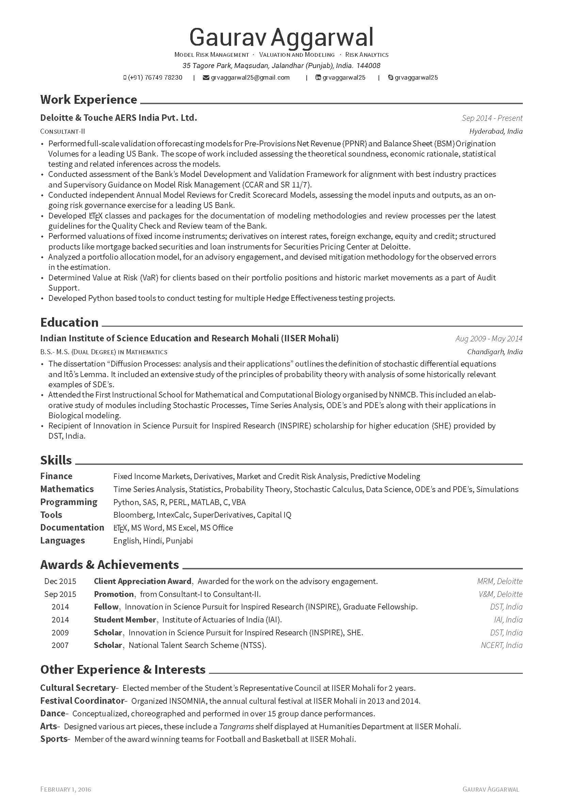

# MyResume

This resume is edited version of a great design avaiable as [**Awesome CV**](https://github.com/posquit0/Awesome-CV). Awesome CV is LaTeX template for a **CV(Curriculum Vitae)** or **resume** or **cover letter** inspired by [Fancy CV](https://www.sharelatex.com/templates/cv-or-resume/fancy-cv). It is easy to customize your own template, especially since it is really written by a clean, semantic markup.

## Preview
You can see [PDF](resume.pdf)

## Disclaimer

This resume builds upon and is a trivially edited version of the [**Awesome CV**](https://github.com/posquit0/Awesome-CV). The author does not claim it as his own. Please feel free to add suggestions. 
